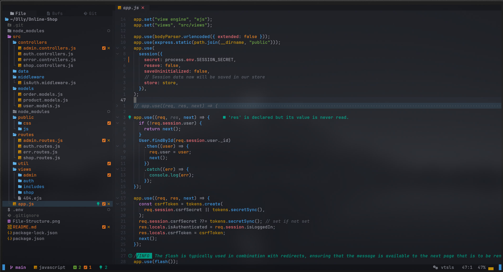

# 📦 Backend API with Node.js, Express, and MongoDB

A scalable backend REST API project built with **Node.js**, **Express.js**, **MongoDB**, and **Mongoose** following the **MVC architectural pattern**.

---

## ✨ Features

- MVC (Model-View-Controller) structure
- MongoDB integration with Mongoose
- Environment configuration
- Modular routing
- Centralized error handling
- Express middleware usage
- JSON-based API responses

## 📁 Project Structure

<!-- [comment]: Need to Update this later with a nicer image but just to get a glimpse of File Structure, As this grows it will change -->

---

## 🛠️ Technologies Used

#### Node.js – JavaScript runtime

#### Express.js – Fast web framework

#### MongoDB – NoSQL database

#### Mongoose – MongoDB ODM

#### Dotenv – Environment variable loader

#### Nodemon – Development server reloader (dev only)

#### EJS - Embedded JavaScript templating

 

Extra Packages and frameworks used

- Express-Validator

---

🧑‍💻 Author

Olly – Aspiring Junior Backend Developer
📧 [softwaredevdad@gmail.com]
🌐 [https://devdad.org]

---

---

📄 License

This project is licensed under the MIT License.

---

🙌 Contributing

Pull requests are welcome! For major changes, please open an issue first to discuss what you would like to change.
