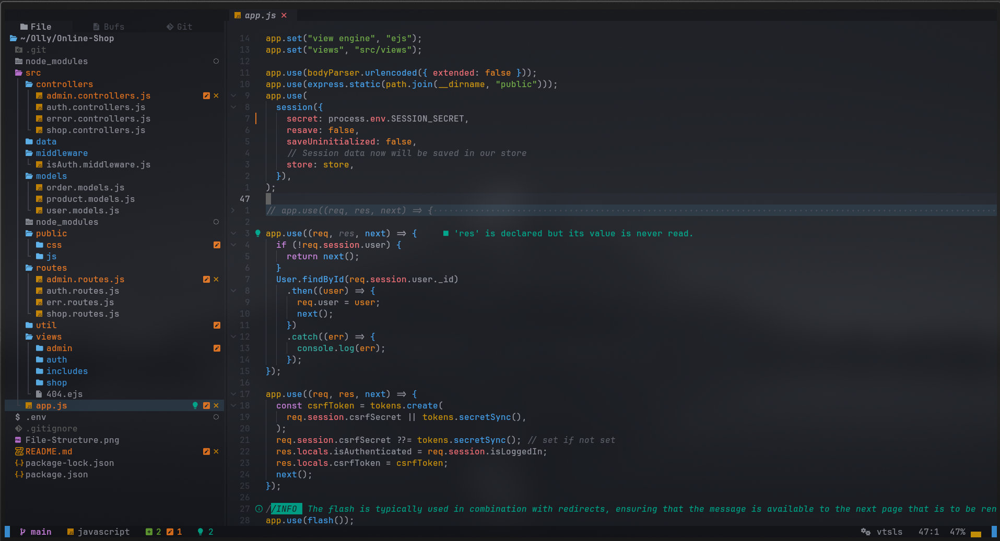
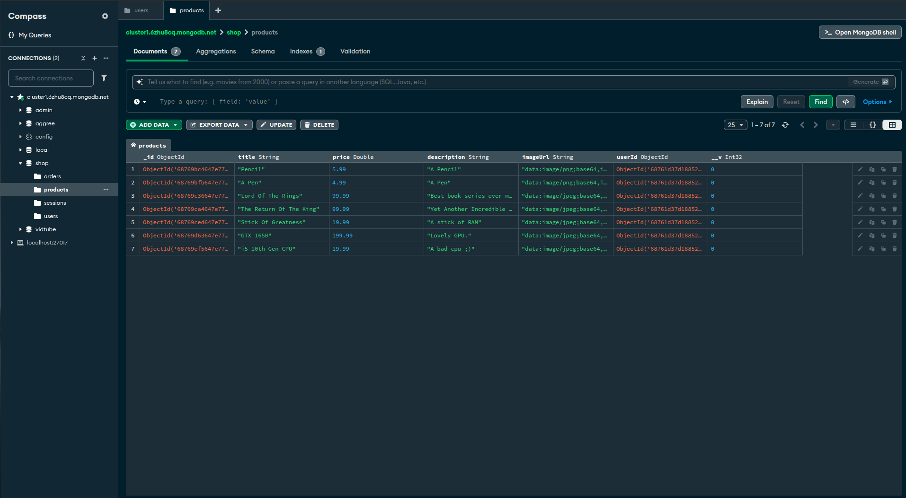

# 📦 Backend API with Node.js, Express, and MongoDB

https://github.com/user-attachments/assets/53f59928-56f8-408f-bd16-3527ad26ac45

 

### A scalable backend REST API project built with **Node.js**, **Express.js**, **MongoDB**, and **Mongoose** following the **MVC architectural pattern**.

---

## ✨ Features

- ### MVC (Model-View-Controller) structure (See Below)
- ### MongoDB integration with Mongoose
- ### Environment configuration
- ### Modular routing
- ### Centralized error handling
- ### Express middleware usage
- ### SSR (Server-Side Rendering)
 

---

## Showcases

 📁 Project Structure 

 📁 MongoDB-Compass 

## 

---

## 🛠️ Technologies Used

- ### Node.js – JavaScript runtime

- ### Express.js – Fast web framework

- ### MongoDB – NoSQL database

- ### Mongoose – MongoDB ODM

#### Dotenv – Environment variable loader

#### Nodemon – Development server reloader (dev only)

#### EJS - Embedded JavaScript templating

 

Extra Packages and frameworks used

 

- Express-Validator

---

🧑‍💻 Author

Olly – Aspiring Junior Backend Developer

📧 softwaredevdad@gmail.com

🌐 https://devdad.org

---

📄 License

This project is licensed under the MIT License.

---

🙌 Contributing

Pull requests are welcome! For major changes, please open an issue first to discuss what you would like to change.
